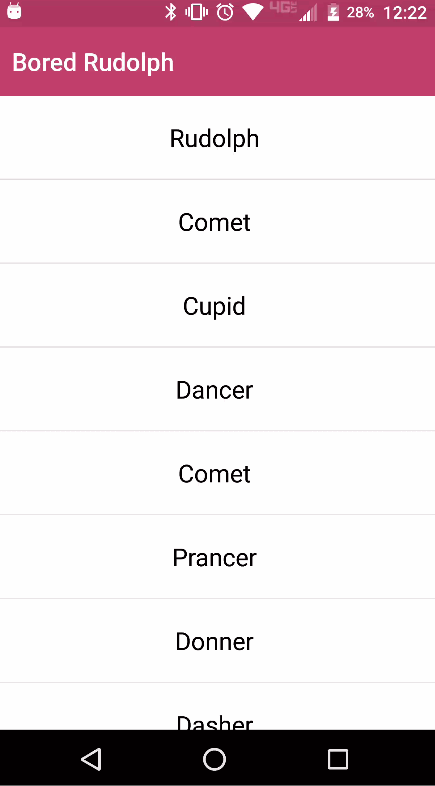

[](https://www.npmjs.com/package/nativescript-bored-rudolph)
[](https://www.npmjs.com/package/nativescript-bored-rudolph)

# NativeScript-Bored-Rudolph :recycle:
NativeScript plugin for a custom hidden game inside a pull-to-refresh layout.

## Demo



#### Native Library
[Bored Rudolph](https://github.com/FauDroids/Bored-Rudolf)

### Installation
From your command prompt/termial go to your app's root folder and execute:

`tns plugin add nativescript-bored-rudolph`

## Usage

### XML
```XML
<page 
  xmlns="http://schemas.nativescript.org/tns.xsd" 
  xmlns:BR="nativescript-bored-rudolph" loaded="pageLoaded">
  <ActionBar title="Bored Rudolph" backgroundColor="#BF4066" color="#fff" />
  <stack-layout>
    <BR:BoredRudolph refresh="{{ refreshList }}" id="rudolph">
      <Button text="End Refreshing" tap="{{ stopRefresh }}" visibility="{{ isRefreshing ? 'visible' : 'collapsed' }}" />
      <list-view items="{{ users }}">
        <list-view.itemTemplate>
          <label text="{{ name }}" row="0" col="1" textWrap="true" class="message" />
        </list-view.itemTemplate>
      </list-view>
    </BR:BoredRudolph>
  </stack-layout>
</page>
```

### TS
```TS

  public stopRefresh(args: any) {
    let boredRudolph: BoredRudolph = args.object;
    boredRudolph.refreshing = false;
  }

```


## Attributes
**refresh : function** *optional* - this event is triggered when you set the BoredRudoplh *refresh* property equal to false.

## API

### refreshing

Property. Notifies the widget that the refresh state has changed.
